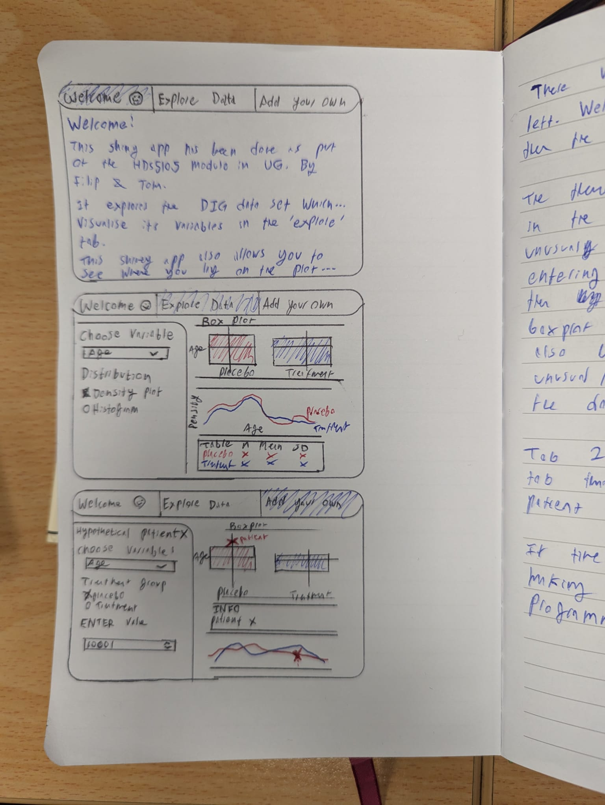

```{r setup, include=FALSE}
knitr::opts_chunk$set(echo = TRUE)
```

##APP PLAN:

```{r}

```

TAB 1: Welcome
This tab will introduce the user to the assignment, talk a bit about the data and the theme of the project.

TAB 2: Explore
This tab will have box plots comparing placebo and treatment, density plot/ histogram and stat table. Variables available will be age, BMI, klevel, creat, and the two blood pressures.

TAB 3: Patient X
This tab will allow the user to enter his own value for a selected variable (also choose treament/ placebo). The variable will then be plotted and represented on the box plot and density plot. Also an info box will be present which will state how unusual the patient is compared to the data set.

THEME:
If time allows for it we can make a nice military/ secret operation theme for the app.

DESIGN:
Let's keep the UI and server files separate. Maybe try use plotly wherever possible even though the statistics table is included in the interface(?).


